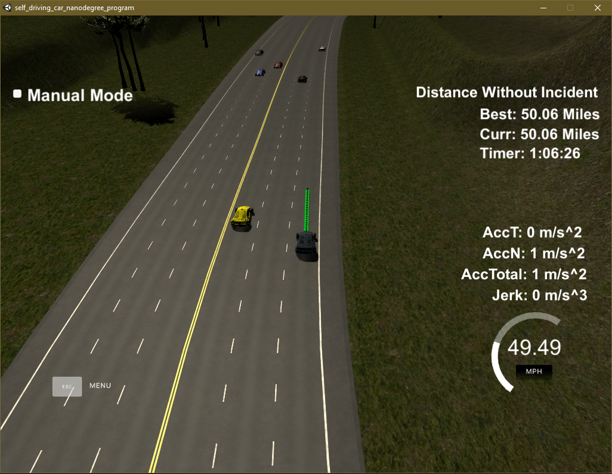
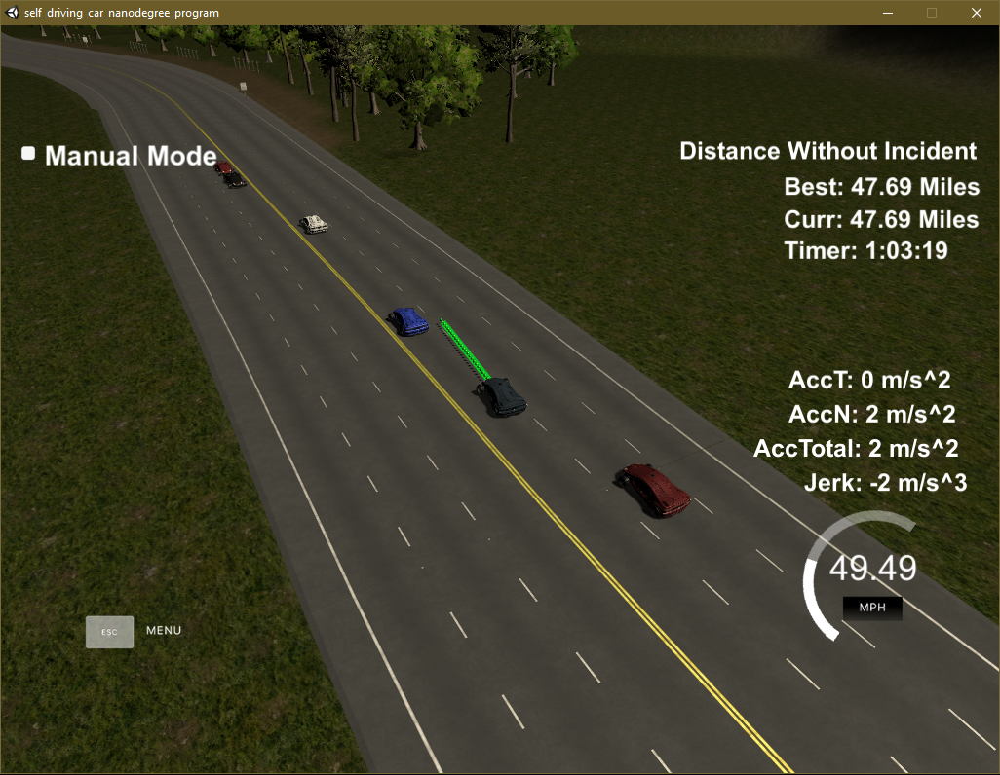
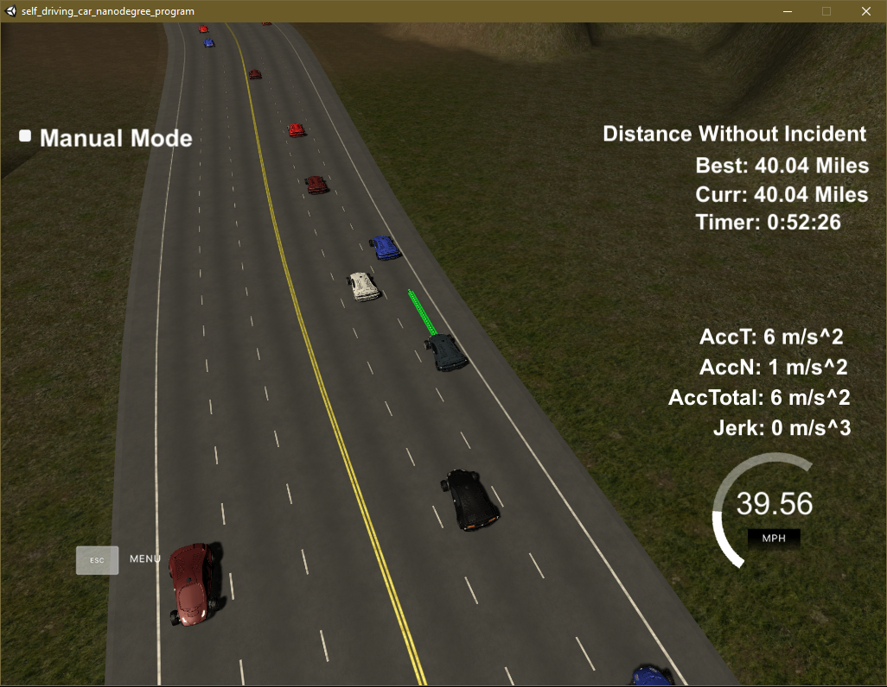

# CarND-Path-Planning-Project

Udacity Self-Driving Car Engineer Nanodegree Program

[](http://www.udacity.com/drive) 

## Building and Running the Code

The original README for this Udacity project contains instruction for building and running the code, including installation of required dependencies and the simulator. The README is included with the original Udacity repository [here](https://github.com/udacity/CarND-Path-Planning-Project).

**Note:** `CMakeLists.txt` has been modified from the original in order to buld the project from several separately compiled source files, rather than the single `main.cpp` source file provided with the project.

This line:

```md
set(sources src/main.cpp)
```

has been changed to:

```md
set(sources src/main.cpp
            src/vehicle.cpp
            src/cost.cpp
            src/helpers.cpp)
```

## Overview

The goal of this project is to (autonomously) drive a car on a simulated highway populated with other vehicles travelling near the 50 mph speed limit. The car must obey the speed limit (i.e. not exceed 50 mph), and avoid collisions while choosing a path that allows the car to progress efficiently. In addition, the ride should be comfortable for the car's (virtual) passengers, which means that acceleration and jerk must be constrained to less than 10 m/s<sup>2</sup> and 10 m/s<sup>3</sup>, respectively.

## [Rubric](https://review.udacity.com/#!/rubrics/1971/view) Points

### Compilation

#### The code compiles correctly

### Valid Trajectories

#### The car is able to drive at least 4.32 miles without incident

In numerous tests, the car consistently drove more than 4.32 miles without incident. The best run achieved over 50 miles without incident before the simulation was manually terminated, as evidenced by the screen capture below. In the simulation shown, the average speed over the 1 hour and 6 minutes was ust over 45 mph.



#### The car obeys the speed limit

The car never exceeds the 50 mph speed limit. The configured maximum speed for the car is configured to be 49.5 mph.

#### Max acceleration and jerk are not exceeded

The magnitude of total acceleration rarely exceeds 7 m/s<sup>2</sup>, staying below the maximum allowable 10 m/s<sup>2</sup>. Likewise, the maximum jerk (up to 10 m/s<sup>3</sup> is allowed) is never exceeded. The magnitude of jerk mostly stays below 3 m/s<sup>3</sup>.

#### The car does not have any collisions

The car avoids collisions by maintaining safe distance margins while following a slower vehicle and when changing lanes. In addition, a high cost is assigned to paths that might result in a collision.

#### The car stays in its lane except while changing lanes

The car is never outside a lane (or between lanes) for more than 3 seconds. The car always drives in one of the three lanes on the right side of the double line (i.e. it does not cross into oncoming traffic, nor does it leave the road by driving on the shoulder).

#### The car is able to change lanes

The car is able to - and does - change lanes. The image below shows the car beginning a lane change from the left lane to the center lane.



### Reflection

#### Implementation

##### Code Structure

The source code is divided into four "modules":

- [`main.cpp`](./src/main.cpp)  the boilerplate code for the main simulation loop
- [`vehicle.cpp`](./src/vehicle.cpp) implementation of a [`Vehicle` class](./src/vehicle.h#21) for encapsulating vehicle state ([`vehicle.h`](./src/vehicle.h) contains the definition)
- [`cost.cpp`](./src/cost.cpp)  functions for computing the "cost" of a given path ([`cost.h`](./src/cost.h) contains the function prototypes)
- [`helpers.cpp`](./src/helpers.cpp) refactored from the supplied [`helpers.h`](./src/helpers.h) (which remains to define the interfaces/function prototypes) to separate interface and implementation

In addition, the file [`parameters.h`](./src/parameters.h) contains symbolic constants to aid in readability and to provide a conventient common location to adjust tuning parameters affecting the performance of the path planning algorithm.

##### Overview of the simulation loop

[`main.cpp`](./src/main.cpp) contains the main simulation loop ([lines 64 - 262](./src/main.cpp#L64)). The real work begins at line 84 (everything before line 84 is boilerplace code for communicating with the simulator). The main loop executes the following steps:

1. Retrieve the ego vehicle state from the simulator ([lines 84 - 92](./src/main.cpp#L84)).
2. Retrieve the sensed environment (list of other vehicles as "tracked objects") from the simulator ([lines 95 - 104](./src/main.cpp#L95)).
3. Compute the projected state of the ego vehicle and the tracked objects ([lines 115 - 123](./src/main.cpp#L115)).
4. Check for vehicles obstructing the lane(s) ahead of the ego vehicle, if necessary, adjust the ego vehicle's speed to maintain a minimum time gap to the vehicle directly in front of it ([lines 125 - 150](./src/main.cpp#L125), [157 - 164](./src/main.cpp#L157)).
5. Choose the vehicle state for the next simulation cycle ([line 153](./src/main.cpp#L153)).
6. Construct or extend the planned path ([lines 169 - 243](./src/main.cpp#L169)). This portion of the code simply performs the mechanics of computing points ((x,y) coordinates) along a spline, using the suggested spline library.

##### Path Planning and Generation

Step 5, above, is modeled on the **_Implement Behavior Planner in C++_** quiz from the classroom.The code for selecting the next best state resides in [`vehicle.cpp`](./src/vehicle.cpp). The method `choose_next_state()` ([lines 52 - 85](./src/vehicle.cpp#L52)) gets a list of possible next states and computes a "cost" for each one. The state with the lowest cost is chosen as the next state.

There are three cost functions in [`cost.cpp`](./src/cost.cpp):

- `inefficiency_cost()` ([lines 13 - 22](./src/cost.cpp#L13)), adapted from the **_Implement a Second Cost Function in C++_** lesson, penalizes travelling in a slower lane.
- `collision_cost()` ([lines 26 -61](./src/cost.cpp#L26)) assigns a penalty for a collision or "near collision" when attempting to change lanes. This cost decreases as the gap between a leading and a following car in the intended lane increases.
- `congestion_cost()` ([lines 64 - 84](./src/cost.cpp#L64)) assigns a cost based on the distance to a potential leading vehicle in the intended lane. This cost increases as the "buffer" distance decreases and is intended to favor paths that will allow the ego vehicle to progress further down the road.

The three costs are computed and weighted in `choose_next_state` (`vehicle.cpp` [line 74](./src/vehicle.cpp#L74)). The cost of a collision is given the highest weight while the inefficiency cost is weighted the least. While it seems obvious that the collision cost should be the most important, the relative weights for inefficiency and crowding were determined experimentally by observing the planning behavior in numerous simulations.

The generation of the chosen path is inspired almost entirely by the **_Project Q&A_**, using the spline library to generate a smooth path that either follows the center line of the current lane (for lane keeping) or transitions from the current lane into the next lane. The performance of the generated path (i.e. limiting acceleration and jerk) was tuned through extensive experimentation. This is where having all the important parameters defined in one place ([`parameters.h`](./src/parameters.h)) became extremely beneficial. The [following excerpt](./src/parameters.h#L24) shows the final tuned values for the various performance-related parameters:

```C++
// constants for tuning the algorithm
constexpr int PATH_BUFFER_SIZE = 30;
constexpr int NUM_SPLINE_PTS = 3;
constexpr double SPLINE_PTS_SPACING = 30.0;     // [m]
constexpr double CAR_LENGTH = 4.5;              // [m] (based on avg mid-size car)
constexpr double FOLLOWING_GAP = CAR_LENGTH * 2.5;
constexpr double FOLLOWING_TIME_GAP = 1.0;      // [s]
constexpr double CUTIN_GAP = CAR_LENGTH * 2;
constexpr double SPEED_LIMIT = ROAD_SPEED_LIMIT - 0.5;  // [mph]
constexpr double SPEED_INCREMENT = 0.25;                // [mph/update_rate]
constexpr double LOOK_AHEAD = 500;      // [m]
constexpr double LOOK_BEHIND = 500;     // [m]
```

#### Conclusion

The implemented path planner performs well enough to meet the project requirements, proven by simulating over 50 miles of incident-free driving. Real-world driving, however, would require further improvements and a **lot** more testing. 

##### Room for improvement

While testing and tuning the algorithm, I observed a few instances of collisions that were clearly caused by another vehicle moving laterally into the ego vehicle (a so-called "side-swipe"); avoiding these collisions would require defensive maneuvering, which I believe was beyond the scope of this project.

One frustrating defect of the implemented path planner is it's inability to look further than the adjacent lane for opportunited to increase efficiency. In the image below, the ego vehicle is "stuck" in the right lane following a vehicle that is moving slower than the speed limit but a bit faster the vehicles in the center lane. The far left lane is available for further progress at the speed limit but the planner considers only the immediately next state (i.e. it can't plan a few moves ahead). Some implementation of a state space search using A* might be beneficial in solving this problem.



Another improvement could be the ability to slow down in order to more quickly change lanes into a gap in an adjacent lane. As implemented, the planner only slows down in order to maintain a minimum time gap to a leading vehicle. If there is a gap in faster moving traffic in an adjacent lane, the car simply waits for the gap to advance to it's position.
